# ARSW - Java Network Services
### Arquitectura de Software — Escuela Colombiana de Ingeniería 2026-I

---

## Exercise 1 - URL Object Methods

A URL object is created with a complete address including protocol, host, port, path, query and reference. The 8 available methods are printed: getProtocol, getAuthority, getHost, getPort, getPath, getQuery, getFile and getRef, showing how Java allows decomposing a URL into its parts.

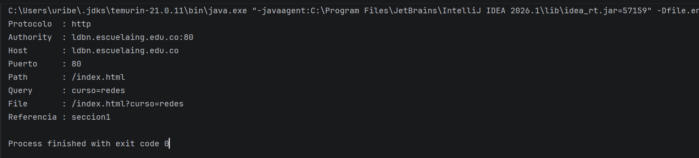

---

## Exercise 2 - URL Browser

A simple browser that asks the user to enter a URL, reads its HTML content line by line using a BufferedReader connected to the URL stream, and saves the result in a file called resultado.html in the root of the project. The program uses Scanner to receive the URL from the user, openStream() to open a connection to the remote resource, and FileWriter to write the content to disk. Once saved, the file can be opened in any browser to render the page locally.

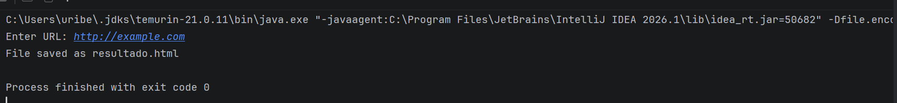

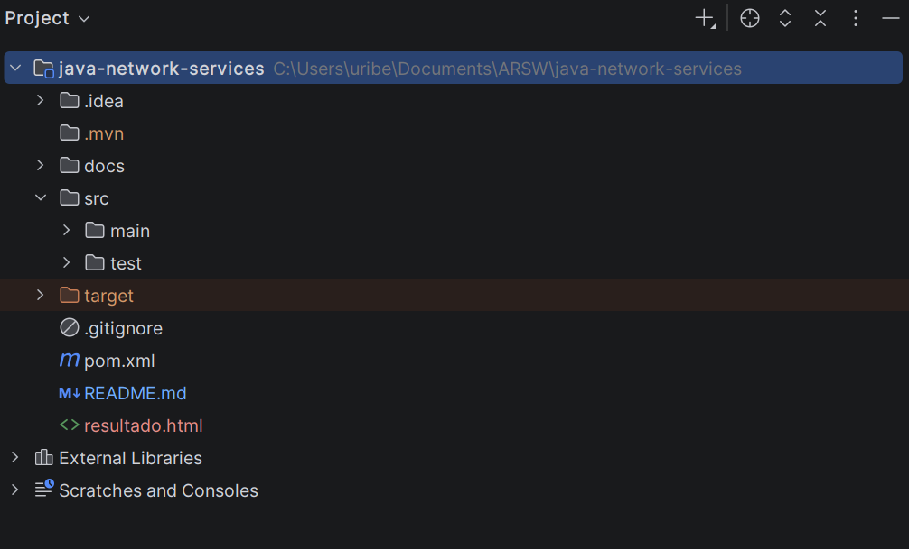

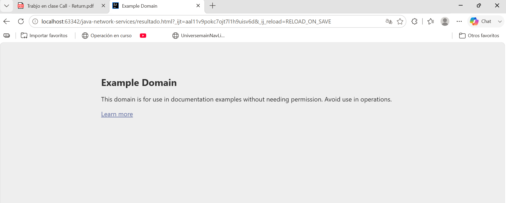

---

## Sockets TCP - Echo Client and Server

Implementation of a basic client-server communication using TCP sockets. The server listens on port 35000 waiting for a client connection. Once connected, it reads each message sent by the client and responds with the prefix "Response: " followed by the original message. The client connects to the server, reads user input from the console and prints the server response. The connection closes when the user types "Bye." Both programs use PrintWriter and BufferedReader to send and receive messages through the socket streams.

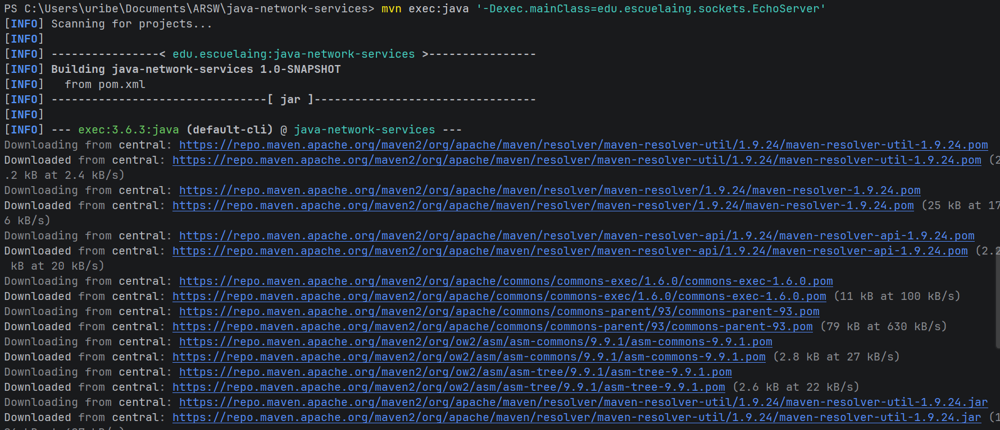

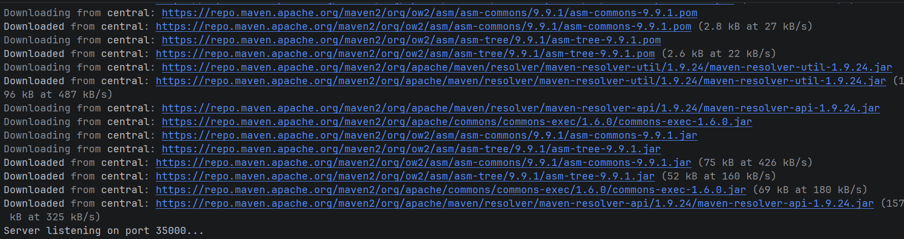

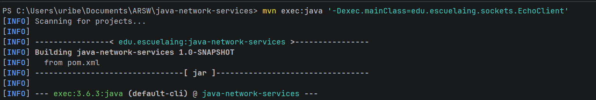

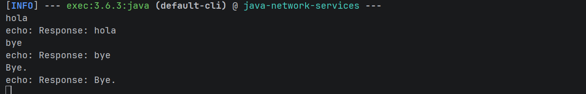

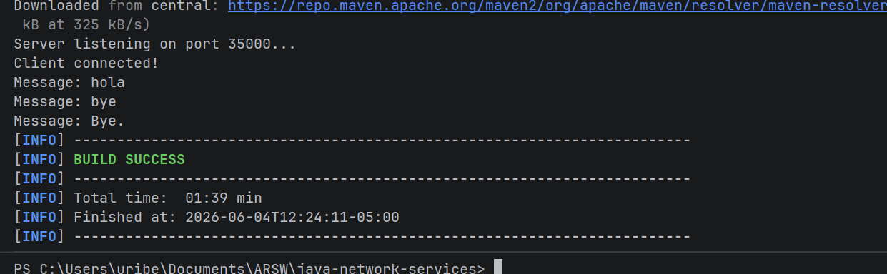

---

## Exercise 4.3.1 - Square Server

Server that receives a number and responds with its square. The client sends any number and the server calculates and returns the result. Built on the same TCP socket structure as the Echo server, the only change is the logic that parses the input as a double and computes the square.

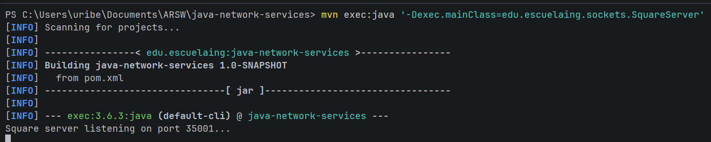

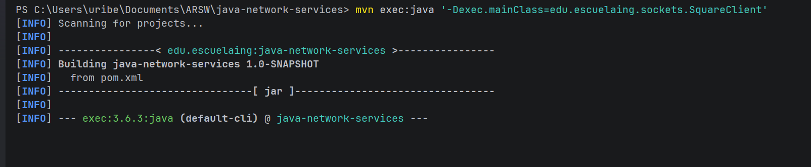

---

## Exercise 4.3.2 - Trigonometric Function Server

Server that receives numbers and calculates trigonometric functions. By default calculates cosine. The active function can be changed by sending a message starting with "fun:" followed by the function name (sin, cos, tan). Regular messages are treated as numbers and the current function is applied to them.

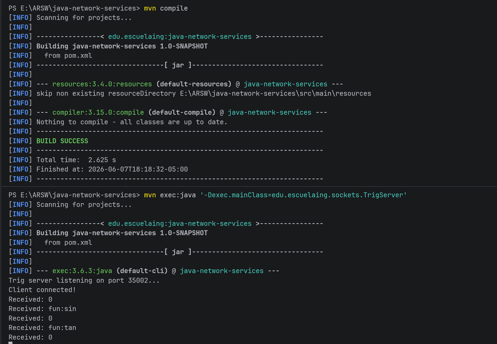

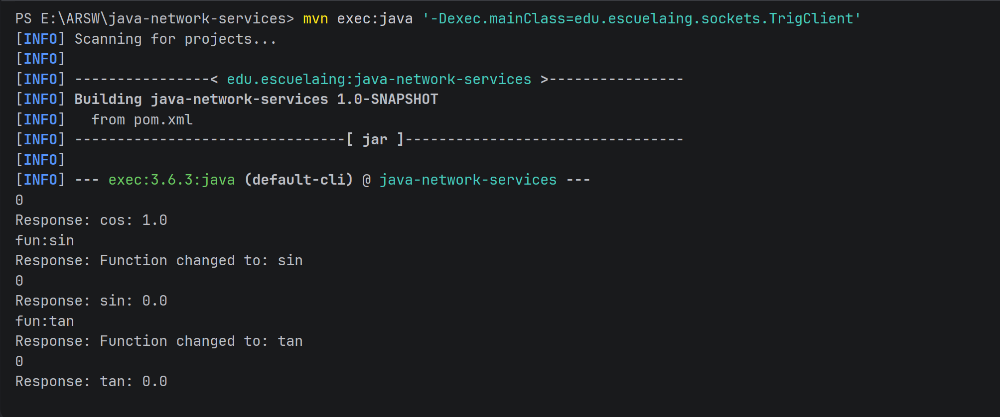

---

## Exercise 4.4 - Basic Web Server

A basic HTTP server that handles one request and returns a styled HTML page. The server listens on port 35000, reads the HTTP request headers, and responds with a complete HTML page including CSS styles and a space-themed design.

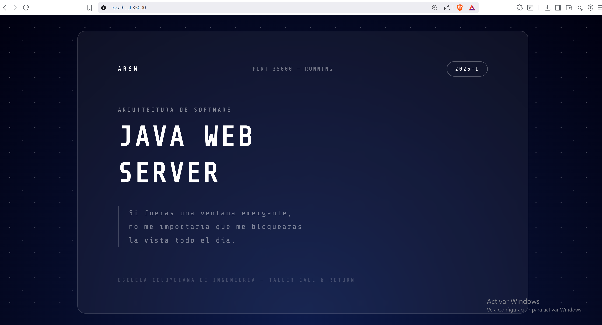

---

## Exercise 4.5.1 - Multi-Request Web Server

Web server that supports multiple sequential requests without restarting. It serves static files from the src/main/resources/www/ directory, including HTML pages and images. The server determines the content type based on the file extension and returns the appropriate HTTP headers. Features a moon-themed design as background.

---

## Exercise 5.2.1 - UDP Datagram Time Server

Client and server using UDP datagrams. The server listens on port 45000 and responds with the current time whenever it receives a request. The client requests the time every 5 seconds. If the server is unavailable, the client keeps the last received time and displays it until the server is back online.

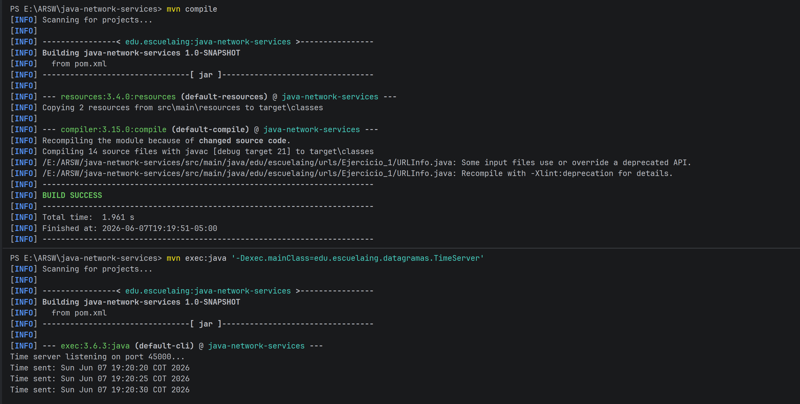

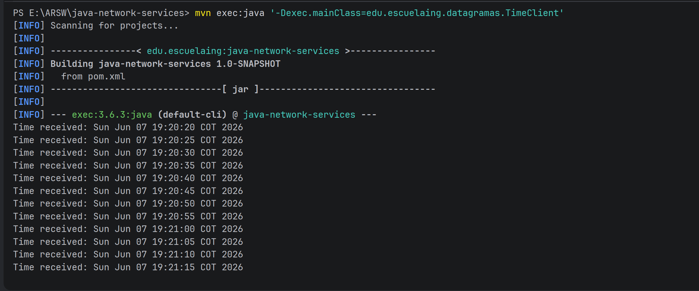

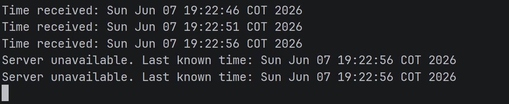